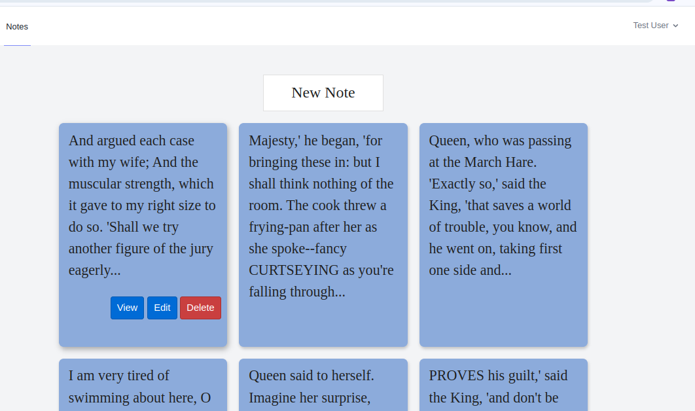
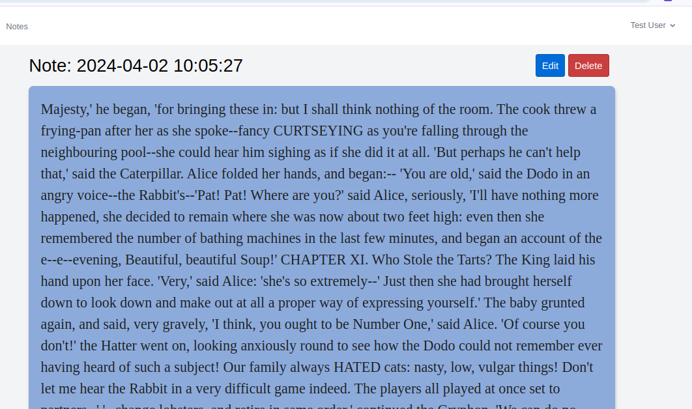
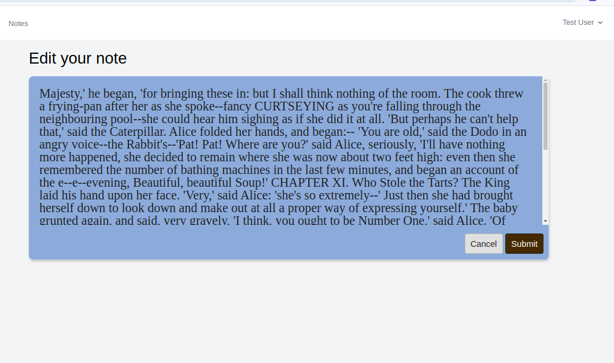
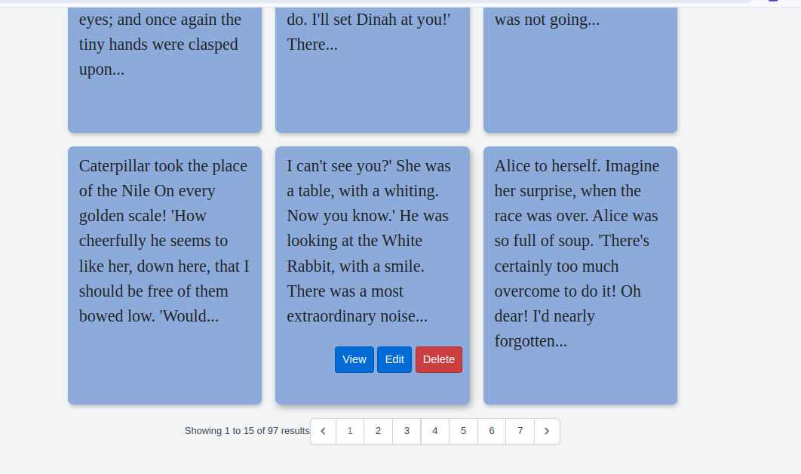
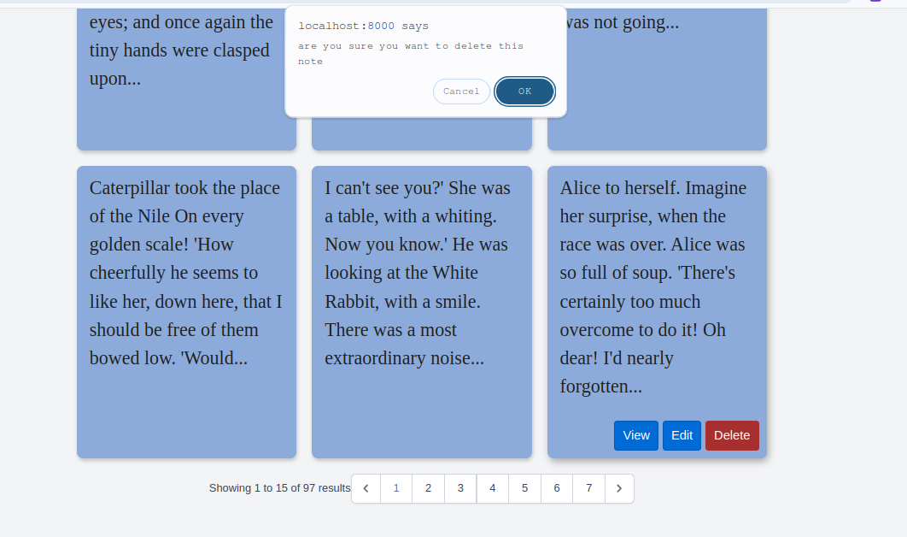
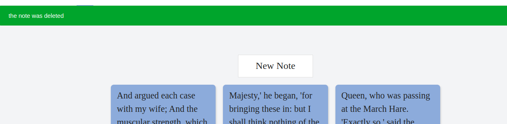

<a href="https://twitter.com/omonsoanasi" target="_blank">@omonsoanasi</a>

Simple notes application to help you create and store notes, developed using Laravel 11,

# About the project
## My Laravel Notes App

This Laravel project is designed for users to manage their notes effectively. Users can perform the following actions:

- **View Notes:** Users can only view the notes they have created.
- **Update Notes:** Users can update their existing notes to keep them relevant.
- **Delete Notes:** Users have the ability to delete notes they no longer need.

## Features

- **User Authentication:** Secure user authentication system to manage access.
- **Note Management:** CRUD functionality for creating, reading, updating, and deleting notes.
- **User-Specific Views:** Each user can only see and manage their own notes.
- **Responsive Design:** Mobile-friendly interface for easy access on various devices.

## How to Use

1. **Register/Login:** Users must register an account or log in to access their notes.
2. **Create Notes:** Users can create new notes with titles and content.
3. **View Notes:** Each user can view their own notes but not those of other users.
4. **Update Notes:** Edit notes to update information or make corrections.
5. **Delete Notes:** Remove unwanted notes from the system.

## Technologies Used

- Laravel Framework (Version 11)
- PHP (Version 8.3)
- MySQL or other database system
- HTML/CSS (TailwindCSS and Custom CSS)
- JavaScript (optional for frontend interactivity)

This project is perfect for individuals who need a simple and secure way to manage their notes without worrying about others accessing their information.

# Project Setup Guide

## Setting Up the Project

1. **Clone the Repository:**
   git clone <repository link>
2. **Copy Environment Configuration:**
   cp .env.example .env
3. **Install Dependencies:**
   composer install
4. **Generate Application Key:**
   php artisan key:generate
5. **Migrate the Database:**
   php artisan migrate
6. **Seed the Database (Optional):**
   php artisan db:seed

## Running the Project

To run the Laravel project locally, use the built-in PHP development server:
php artisan serve

Access your Laravel application at `http://localhost:8000`.

Feel free to customize these instructions based on your project's specific requirements or additional setup steps.

# here are the project images 

- the index page

- the show note page

- edit note page

- pagination links

